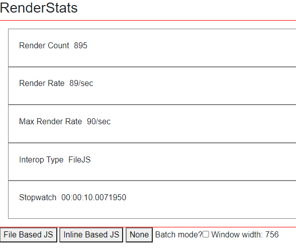
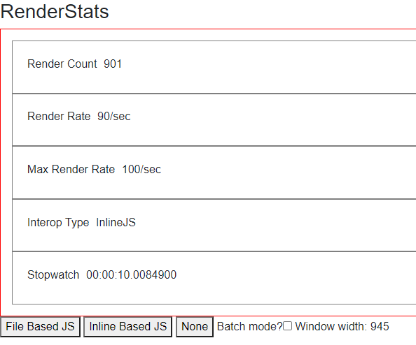
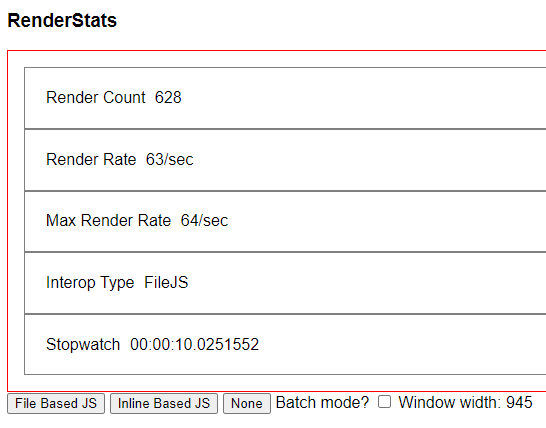
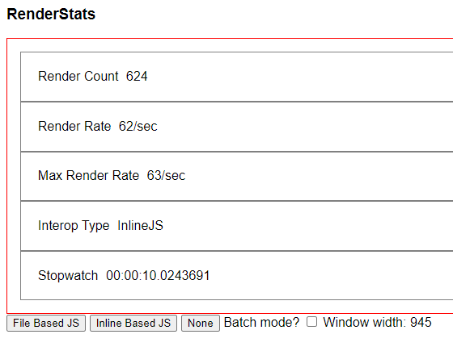

# Quick rough and ready perf test

This came from a conversation on Gitter where it was claimed that using "eval" was a performance drain.

Gitter link: [July 11, 2020 11:51 AM](https://gitter.im/aspnet/Blazor?at=5f0999c73c217837fd9091e8)

It doesn't appear to be significant.

## WASM Non-batched (renders every iteration)
### Using a JS function in a script

### Using eval

## Server Non-Batched

### Using a JS function in a script

### Using eval
